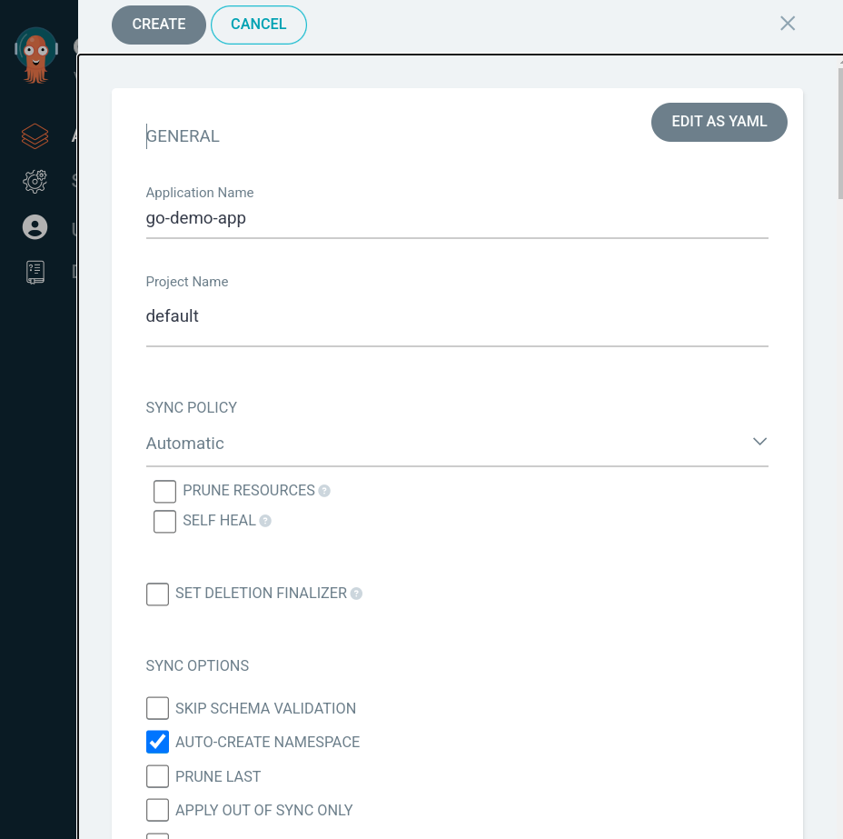
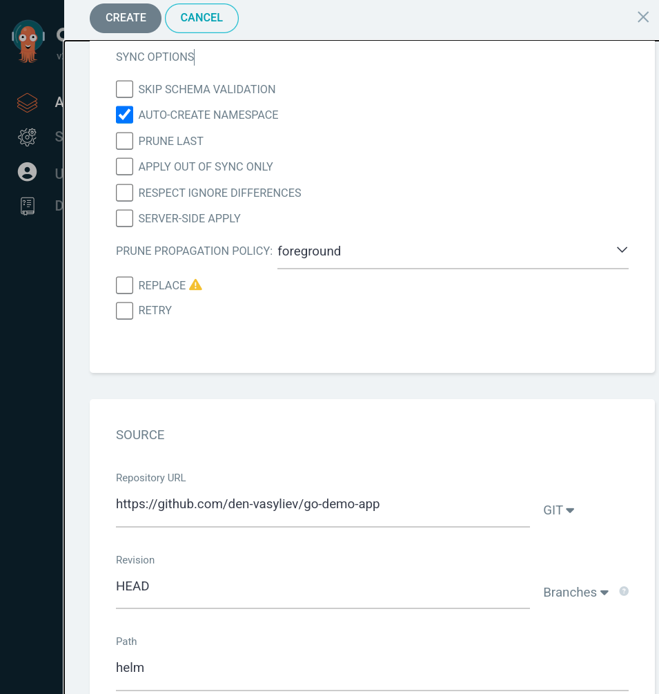
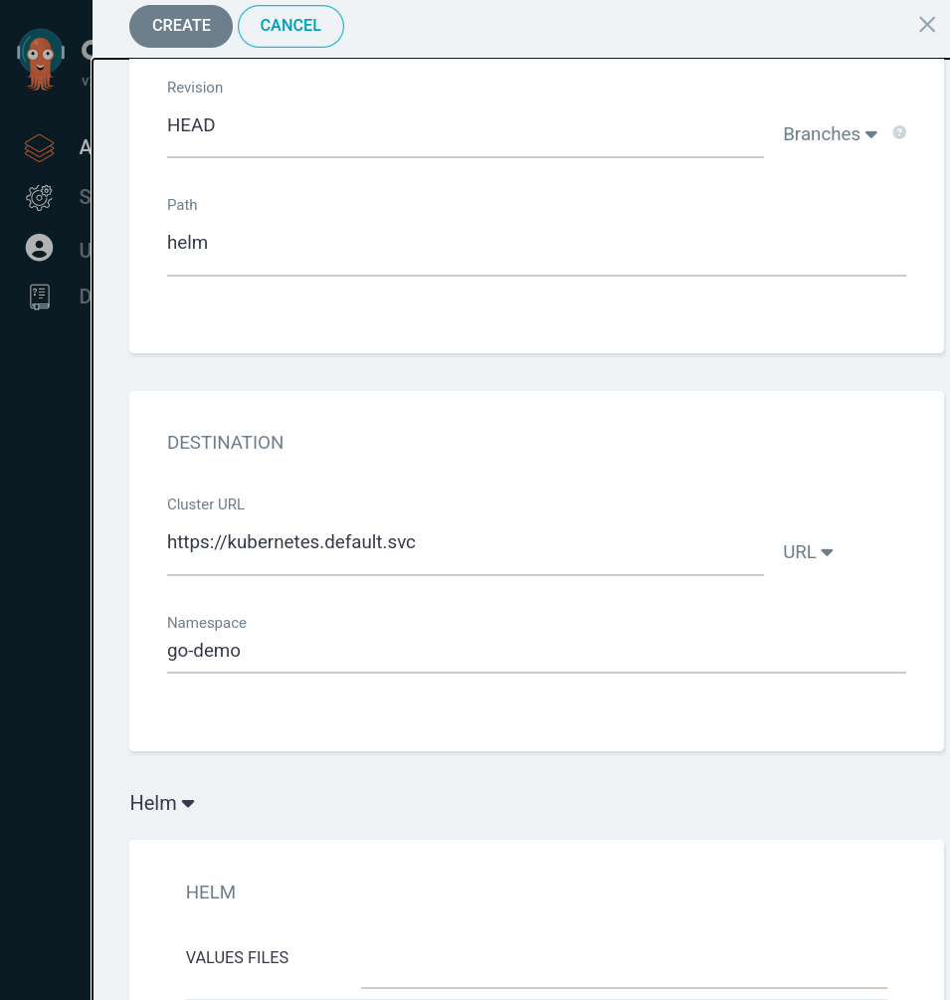
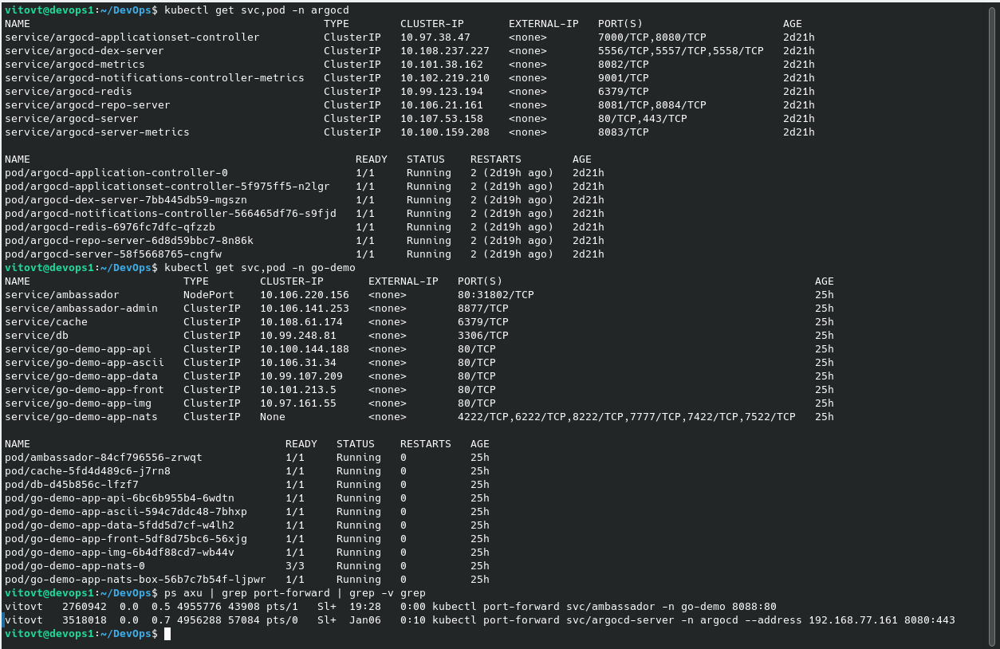

# Ascii Artify MVP Development and ArgoCD Integration Guide

## Introduction

This guide provides a comprehensive overview of developing the Ascii Artify MVP (Minimum Viable Product) and integrating it with ArgoCD for automated deployments. Ascii Artify is a software product designed to convert images into ASCII art using Machine Learning algorithms.

### Ascii Artify MVP Overview

Ascii Artify MVP is a streamlined version of the Ascii Artify software, encompassing essential functionalities to transform images into ASCII art. This phase is critical for validating the concept with a user focus group and involves iterative development based on user feedback.

## Setting Up ArgoCD for Ascii Artify MVP

ArgoCD, a GitOps continuous delivery tool for Kubernetes, plays a vital role in automating the deployment process of the Ascii Artify MVP.

### Steps for ArgoCD Integration

1. **Create an Ascii Artify Application in ArgoCD**: 
   - Link to the Ascii Artify's Git repository (e.g., `https://github.com/den-vasiliev/go-demo-app`).
   - Specify the Kubernetes manifests' location within the repository.
   


2. **Configure Automatic Synchronization**: 
   - Set ArgoCD to automatically synchronize with the latest changes in the Ascii Artify Git repository.
   - Determine sync policies such as manual triggers or automatic deployment upon new commits.







## Demonstrating the Results

For our Ascii Artify MVP, we are focusing on core functionalities, thus a sophisticated GUI is not included at this stage. Here's how we can demonstrate the results:

1. **Port Forwarding to Access the Application**:
   - First, we need to open a port to the Ascii Artify application running on Kubernetes. This can be done using the following command:
     ```
     kubectl port-forward svc/ambassador -n go-demo 8088:80
     ```

2. **Downloading and Converting Images**:
   - We will use the `curl` command to download JPG and PNG files and send them to the Ascii Artify application for conversion. Here are the commands to do so:
     ```
     curl -F "image=@infinity_devops3.png" localhost:8088/img/
     curl -F "image=@infinity_devops2.png" localhost:8088/img/
     curl -F "image=@time_for_devops.jpg" localhost:8088/img/
     ```

3. **Viewing the ASCII Art Output**:
   - The Ascii Artify application converts these images into ASCII art, which is best suited for console output due to its textual nature. This makes it easier to view and validate the MVP's functionality directly from the command line.

4. **Video Demonstration**:
   - A short video will be provided to showcase this process, illustrating how the Ascii Artify MVP takes an image input and outputs it as ASCII art through the console. This visual aid will be an effective way to demonstrate the MVP's capabilities and its working principle.
   


## Final Installation overview


## Conclusion

Integrating ArgoCD with the Ascii Artify MVP development facilitates an efficient, automated deployment process. This integration is instrumental in rapidly delivering new features and fixes, significantly enhancing the development workflow and product responsiveness.